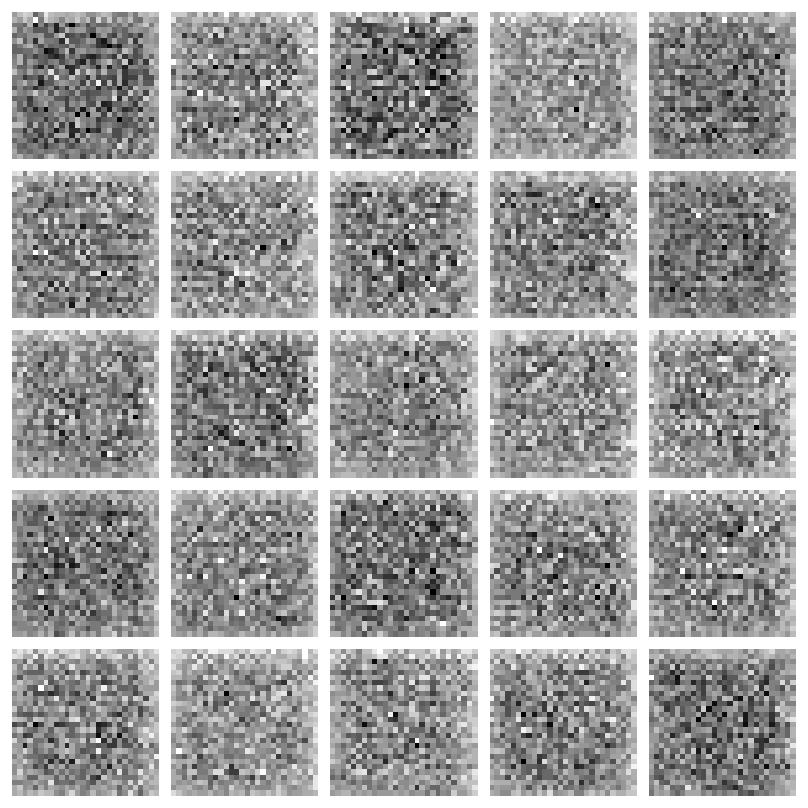
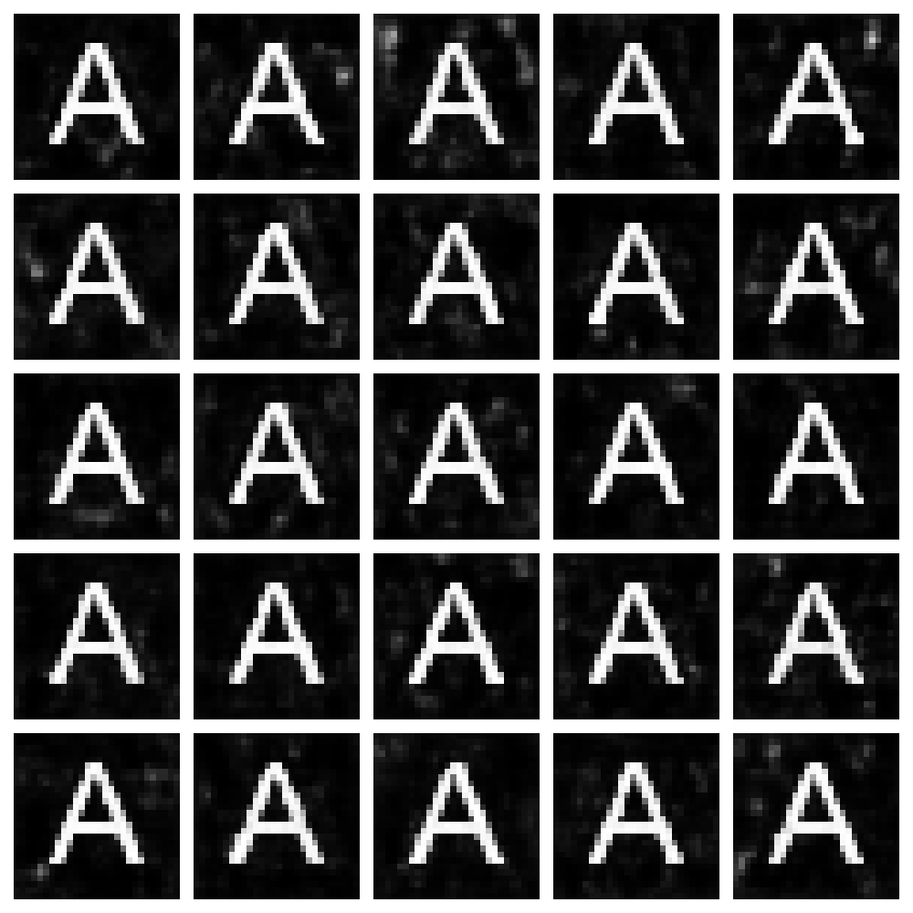
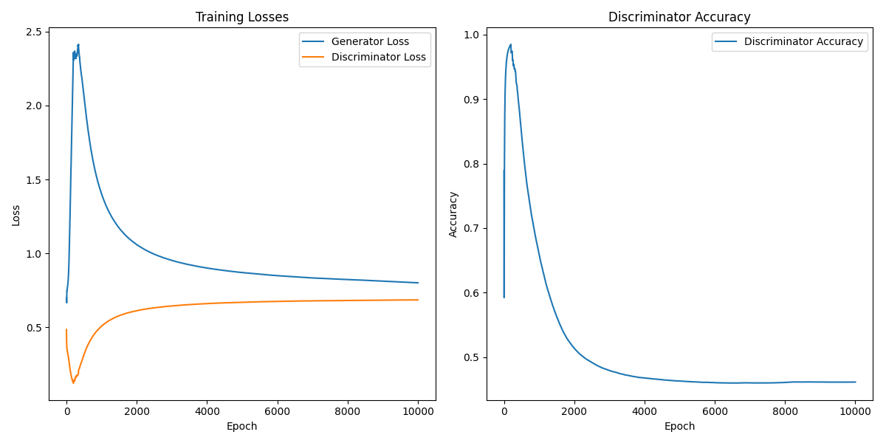

# Typographic Apprentice: A Glyph-Generating GAN

A Generative Adversarial Network (GAN) that learns to generate typographic characters from scratch. This project demonstrates fundamental deep learning concepts through the visually intuitive task of letter generation.

## 🎯 Project Overview

This implementation trains a basic GAN to generate images of the letter 'A' through adversarial training. The generator learns to create increasingly convincing letter forms while the discriminator learns to distinguish real from generated images.

## 📊 Training Progress

### Initial Output (Epoch 0)

*The generator begins with random noise, producing unstructured patterns*

### Final Output (Epoch 9999)

*After training, the generator produces recognizable 'A' characters*

### Training History

*Loss and accuracy metrics showing the adversarial learning process*

## 🏗️ Architecture

**Generator**: Transforms random noise into letter images
- Input: 100-dimensional random vector
- Architecture: Fully-connected layers with Batch Normalization
- Output: 28×28 grayscale image of generated letter

**Discriminator**: Distinguishes real from generated images
- Input: 28×28 grayscale image
- Architecture: Fully-connected layers with Dropout
- Output: Binary classification (real/fake)

## 🚀 Getting Started

### Prerequisites
- Python 3.8+
- TensorFlow 2.x
- NumPy, Matplotlib

### Installation
```bash
git clone https://github.com/YasirShaikh786/typographic-GAN-Generative-Adversarial-Network.git
cd typographic-GAN-Generative-Adversarial-Network
pip install -r requirements.txt